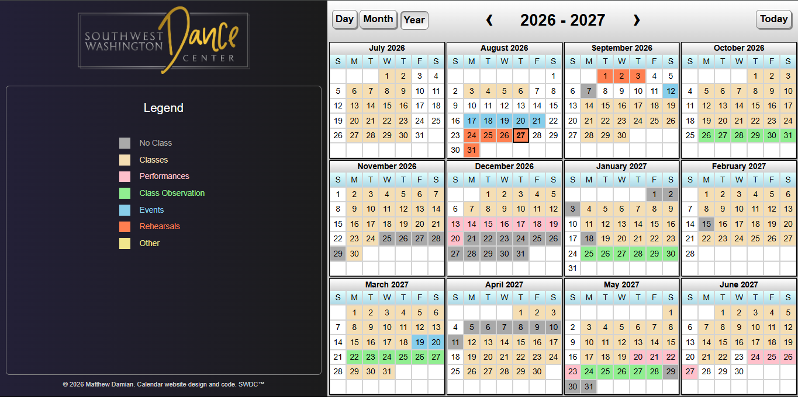
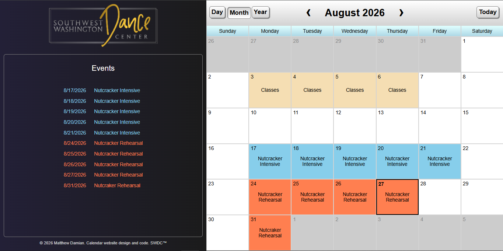
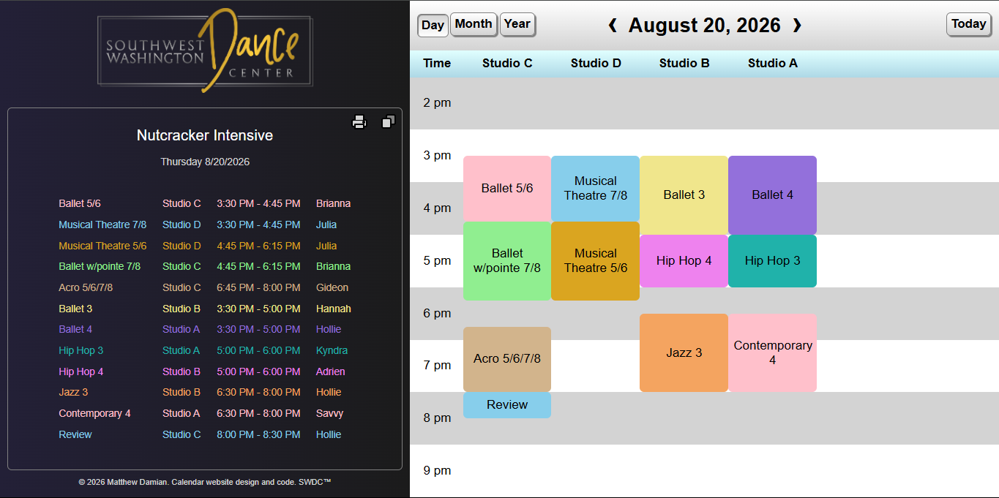

# SWDC Calendar

An interactive website for viewing calendar data for Southwest Washington Dance Center (SWDC).  Automatically pulls data from a [google spreadsheet](https://docs.google.com/spreadsheets/d/1G4BoG5Jumb-N_HVgcvb5e1noY3rL4GG_F5kfpcgIl6s) which designated editors can modify.

## Screenshots
 
 
 

## Spreadsheet Interface
Modifications to the spreadsheet will appear on the website after a refresh.  There are three tabs on the spreadsheet that may be edited:

### EventData
Day-level entries contain a Date, Title, Categories, and Notes
- Dates must be in the format mm/dd/yyyy
  - date ranges may be input as two dates separated by a dash
- Title may be any text
- Categories may be comma separated values from the "Categories" tab
  - only the first category determines the color
  - all listed categories are applied to the event
- Notes may be any text (or blank)

Event level entries contain a Description, Location, Start time, End time, and Instructors
- These entries are applied to whichever day-level entry preceded it.  A day may contain multiple events.
- These entries must leave column A blank, and start on column B.
- Description, location, and instructors may be any text
- Time fields must be in the 12-hour time format (e.g. 4:15 PM)

### WeeklyData
Contains schedules that repeat on a weekly basis. After specifying a time range, you can specify the schedule for each weekday within that time frame.
- Time ranges contain 3 cells: "Duration", start date, end date
  - "Duration" is the literal word
  - start date and end date are each in the format mm/dd/yyyy
- Event entries are the same as for EventData, however the first entry in a group of entries must include a **day of the week** in column A, such as "Monday".  This specifies which weekday the group applies to.

### CategoryData
Each entry consists of a Category and a Color.
- Category may be any text
- Color may be any CSS color
- "No Class" and "Classes" are special categories.  "Classes" corresponds to the WeeklyData, and "No Class" overrides "Classes".

### Notes / Restrictions
- Any line beginning with a # will be ignored.  This may be used to add comments.
- No entries may include double quotes ", because I have not yet implemented a proper parser.
- A change-log is saved automatically, so changes can be reverted if necessary.
